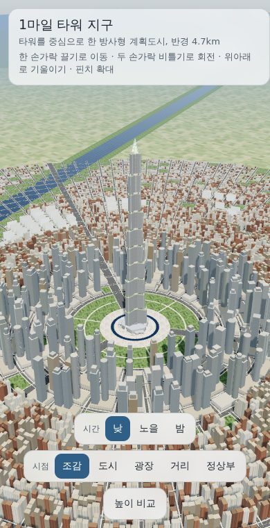
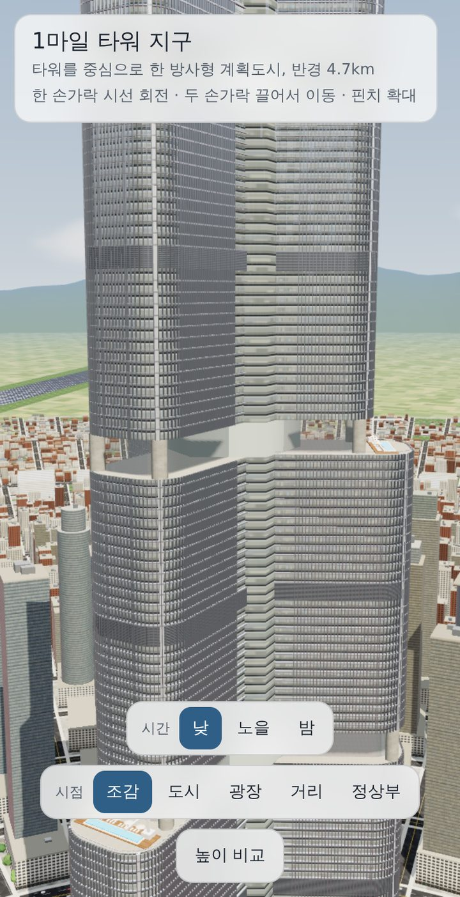
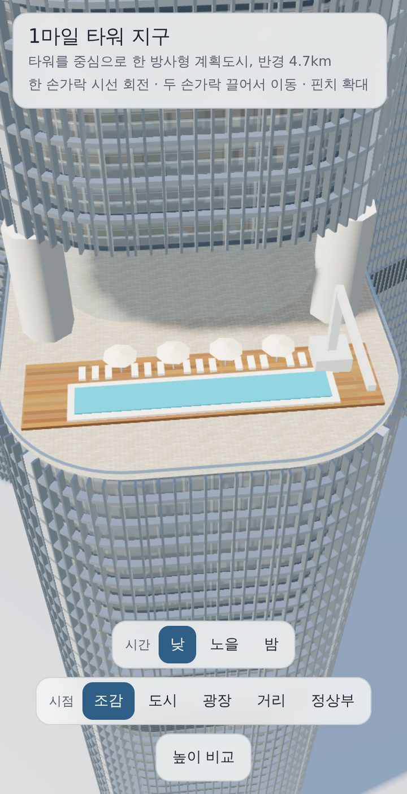
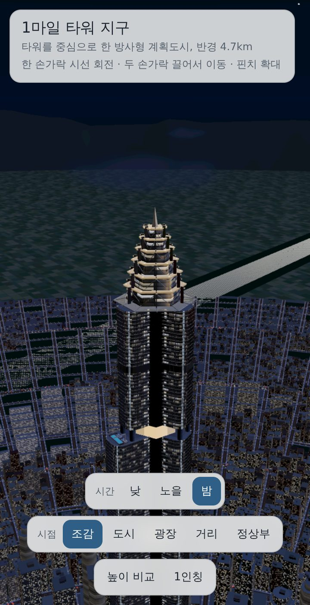
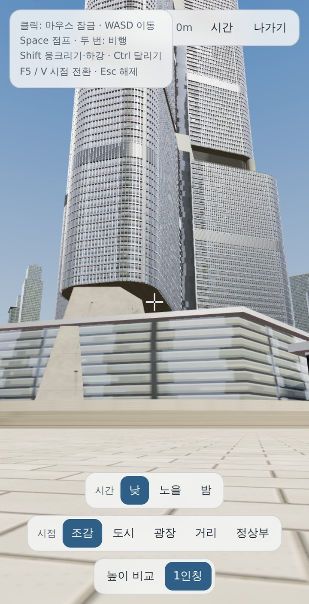
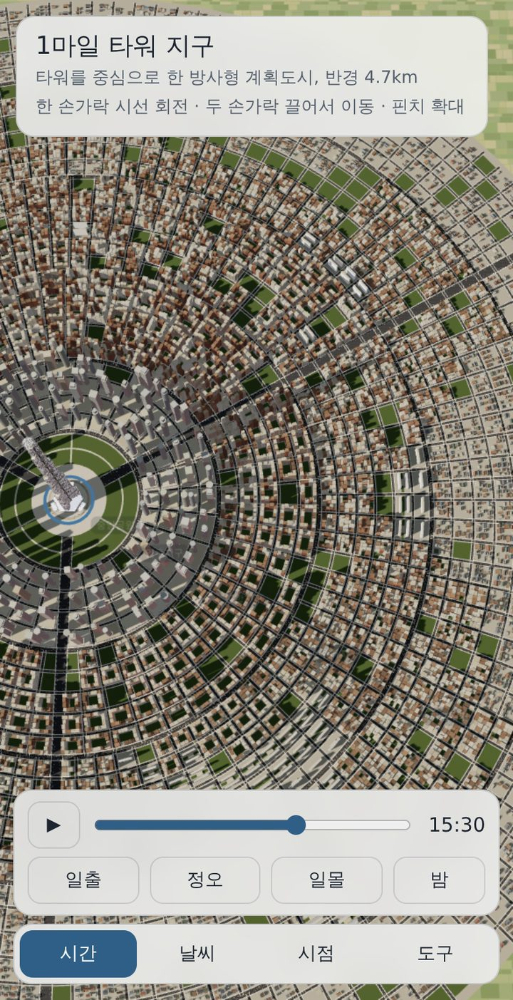
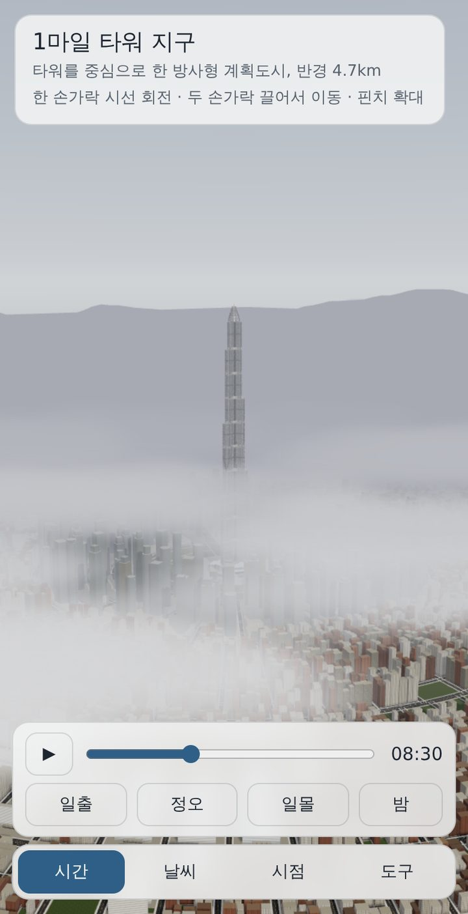
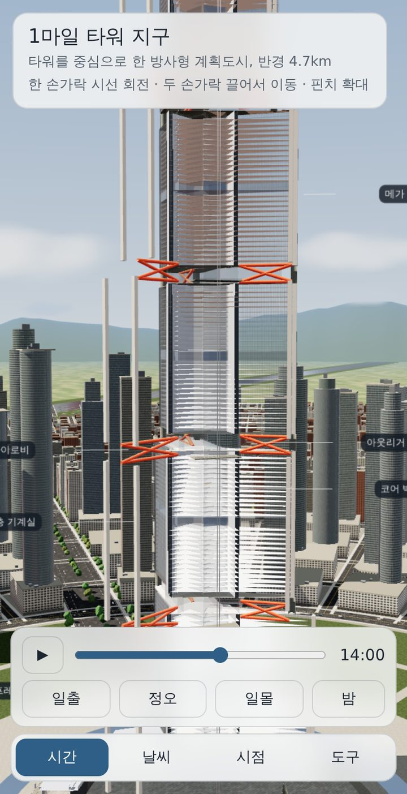
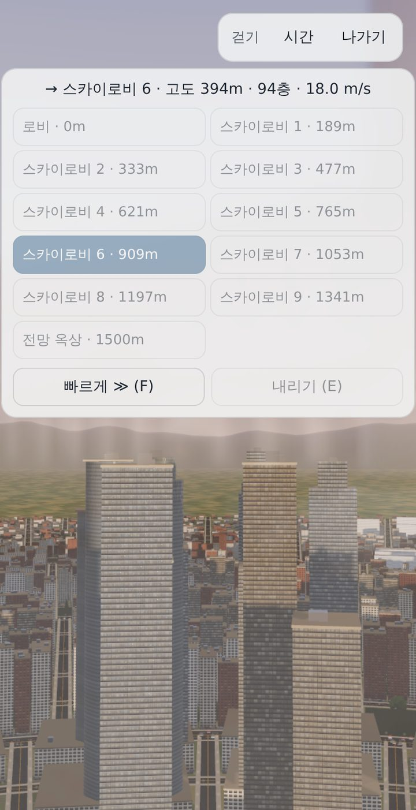
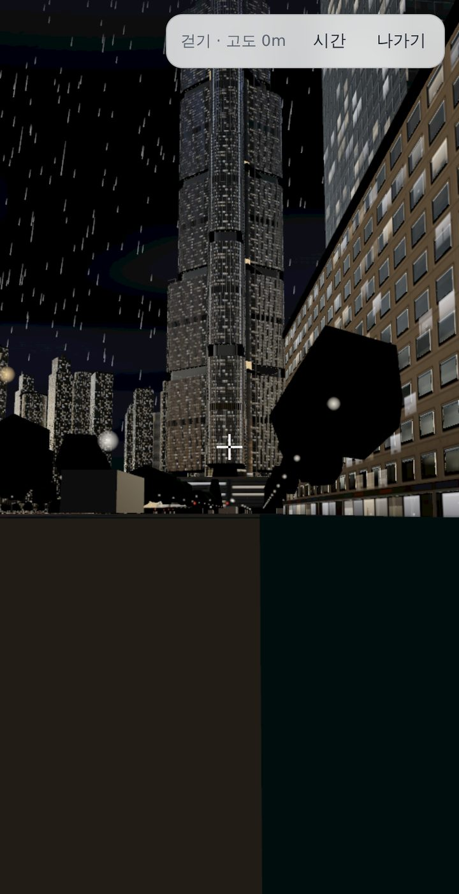

# 1마일 타워 지구 (Mile-High Tower District)

높이 1,609m(1마일), 약 330층 초고층 타워와 그 타워를 중심으로 한 반경 4.7km 방사형 계획도시를
브라우저에서 실시간으로 탐험하는 정적 웹사이트입니다. 



| 입면 | 테라스 풀 | 야간 크라운 | 1인칭 |
| --- | --- | --- | --- |
|  |  |  |  |

## 실행

정적 파일만으로 동작합니다. 

```bash
python3 -m http.server 8000     # → http://localhost:8000
```

`index.html`을 더블클릭해 `file://`로 열어도 동작하지만, 브라우저 보안 정책 때문에 HDR 환경맵을 불러오지 못해 절차적 하늘로 대체됩니다. 웹서버로 여는 것을 권장합니다.

## 폴더 구조

```
index.html          앱 전체 (HTML·CSS·JS)
vendor/             three.js r186 + 후처리·EXR 로더를 하나로 묶은 ES 모듈 (MIT)
assets/hdri/        Poly Haven HDRI 3종 (CC0)
textures/           선택: 실사 스캔 텍스처와 manifest.json
docs/               스크린샷
```

## 조작

| 입력 | 동작 |
| --- | --- |
| 한 손가락 끌기 / 왼쪽 드래그 | 시선 회전 — 방위 360°, 위아래 기울이기 |
| 두 손가락 끌기 / 오른쪽·휠클릭·Shift 드래그 | 이동 — 잡은 지면이 손가락을 따라옵니다 |
| 핀치 / 휠 | 손가락·커서 아래 실제 표면(건물·타워·지면)을 향해 확대·축소, 6m ~ 40km |
| 두 손가락 비틀기 | 방위 회전 (데드존 이후) |
| 두 번 탭 / 더블클릭 | 그 지점으로 확대 |
| 시간 탭 | 시각 슬라이더 · 재생 · 일출/정오/일몰/밤 |
| 시점 버튼 | 조감 · 도시 · 광장 · 거리 · 정상부 |
| 높이 비교 | 롯데월드타워(555m), 부르즈 할리파(828m) 실루엣 |

제스처는 상태 기계로 분리되어 있어 핀치 중에 화면이 돌아가는 교차 반응이 없습니다.

### 태양 궤적 · 날씨 · 단면 · 엘리베이터

- **태양 궤적**: 하단 `시간` 탭. 북위 37.5°, 추분 기준 실제 태양 고도·방위를 계산합니다. 슬라이더, 재생(타임랩스), 일출·정오·일몰·밤 바로가기. 하늘·조명·창문·가로등이 연속으로 바뀌고 그림자가 도시를 쓸고 지나갑니다.
- **날씨**: `날씨` 탭. 비(GPU 빗줄기, 젖은 노면, 서서히 마르는 효과, 야간 번개), 안개(낮은 구름층 위로 타워 상부가 뚫고 올라감).
- **단면**: `도구` 탭. 카메라를 향한 수직면으로 타워를 자르고 외피를 반투명 처리해 층 슬래브, 포셰 처리된 코어 벽, 스카이로비의 아웃리거 트러스, 메가 기둥, 기계실, 샤프트 속 엘리베이터 카를 보여줍니다. 처음 켤 때만 생성됩니다.
- **익스프레스 셔틀**: 1인칭으로 로비 입구에 가면 탑승(E). 두 날개 사이 코어 외벽의 파노라마 유리 셔틀로 스카이로비 1~9와 전망 옥상(1,500m)을 운행합니다. 가속 1.2m/s², 최고 18m/s, 문 0.9초. 다른 층에서 부르면 셔틀이 내려옵니다. 빨리 감기(F), 내리기(E).

| 오후 그림자 | 안개 | 단면 | 셔틀 | 비 오는 밤 |
| --- | --- | --- | --- | --- |
|  |  |  |  |  |

### 1인칭 모드 (마인크래프트 조작)

하단 `1인칭` 버튼, 또는 `F5`·`V` 키로 전환합니다.

| 데스크톱 | 모바일 | 동작 |
| --- | --- | --- |
| 클릭 | — | 마우스 잠금 (Esc로 해제) |
| 마우스 | 화면 끌기 | 시선 |
| W A S D | 방향 패드 | 이동 (걷기 4.3m/s) |
| Space | 점프 | 점프 1.25m · 두 번 누르면 비행 전환 · 비행 중 상승 |
| Shift | 하강 / ● | 웅크리기(가장자리에서 떨어지지 않음) · 비행 중 하강 |
| Ctrl · W 두 번 | 달리기 | 달리기 5.6m/s · 비행 질주 21.6m/s |

모든 건물과 타워에 충돌 판정이 있고, 옥상·테라스·로비 지붕 위에 착지할 수 있습니다.

## 무엇이 절차적으로 생성되는가

모든 형상과 텍스처는 고정 시드(`20260920`)로 런타임에 생성됩니다. 외부 에셋이 없습니다.

- **도시 구조**: 3개의 대로(타워 날개 방향) + 환상도로 + 국지가로 → 블록 약 2,400개
- **필지**: 블록을 재귀 이분할(프랙탈 분할)하여 골목과 불규칙한 필지 생성
- **높이**: fBm 노이즈로 부도심 클러스터 형성, 세장비 제한으로 바늘 건물 방지
- **유형**: 타워+포디움 / 중정형 블록 / 판상형 아파트 / 저층 고밀 / 단독주택(박공지붕) / 공원
- **파사드**: 커튼월·프리캐스트·벽돌·아파트·상가 7종, 각각 컬러·노멀·러프니스/메탈니스·야간 발광·실내 맵
- **실내**: 창문마다 시차(parallax) 매핑으로 천장·바닥·가구가 보이는 방 묘사
- **타워 근접 디테일**: 층마다 슬래브 밴드, 1.5m 간격 유닛 커튼월 멀리언, 세그먼트마다 2개 층 루버 기계실 밴드, 풍도층 스카이로비(후퇴 이중 높이 유리·천장 다운라이트), 셋백 테라스(목재 데크·인피니티 풀·선베드·파라솔·유리 난간·핸드레일·외벽 청소 크레인), 방사형 트러스 캐노피, 6단 크라운(코니스 조명·코너 핀·쉐브런·첨탑). 타워 반경 9.5km 이내에서만 그립니다.
- **기단부**: 타워는 3.6단 유리 로비, 6개 출입 포털(캐노피·기둥·계단·볼라드), 테이퍼 버트레스, 단상과 계단
- **부속**: 건물 출입구(문·캐노피), 상가 저층부, 파라펫, 옥상 설비, 가로수, 차선·횡단 표시, 주행 차량, 가로등, 항공장애등
- **환경**: 물리 기반 톤매핑, 시간대별 반사 환경맵, 원경 산맥, 농지, 구름

## 재질과 조명

- **환경광(IBL)**: Poly Haven HDRI 3종(도시·노을·밤, CC0, `@pmndrs/assets` 경유)을 `assets/hdri/`에서 불러옵니다. 유리에 실제 도시 풍경이 반사됩니다.
- **로이유리**: 창 영역은 비금속·거칠기 0.025, 반사율 F0≈0.1(청록 틴트), 가시광 투과 ≈45%로 실내 시차 매핑과 합성. 판유리마다 미세한 기울기를 줘 반사상이 판 단위로 어긋납니다.
- **콘크리트·아스팔트·잔디·화강석 포장**: 컬러·노멀·거칠기 PBR 맵을 런타임 생성. `textures/manifest.json`에 CC0 스캔 텍스처를 등록하면 교체됩니다(`textures/README.md`).

## 최적화

- 도시를 80개 청크(16방위 × 5대)로 나누고 청크 단위 수동 프러스텀 컬링
- 청크당 인스턴싱(`InstancedMesh`) — 전체 인스턴스 약 9만 개
- 거리 기반 LOD: 260유닛 밖에서는 옥상 설비·파라펫·가로수 비표시
- 그림자 카메라가 시점을 따라다니며 필요한 범위만 커버
- 월드 좌표 기반 UV: 건물마다 UV를 굽지 않고 하나의 지오메트리를 공유
- 후처리는 HDR(half-float) 멀티샘플 렌더타깃에서 수행하고 `OutputPass`가 톤매핑·sRGB 변환, 블룸은 야간·노을에만 활성화

## 기술 스택

- [three.js](https://threejs.org) r186 (MIT) — WebGL2 렌더러, `EffectComposer`·`UnrealBloomPass`·`OutputPass`, `EXRLoader`. esbuild로 묶어 `vendor/three.bundle.min.js`에 포함
- [Poly Haven](https://polyhaven.com) HDRI (CC0), [@pmndrs/assets](https://github.com/pmndrs/assets) 경유
- 폰트: IBM Plex Sans KR (OFL)

## 라이브러리 갱신

`vendor/three.bundle.min.js`는 아래 입력 파일을 esbuild로 묶은 것입니다.

```js
// vendor-entry.js
import * as T from 'three';
import { EffectComposer } from 'three/addons/postprocessing/EffectComposer.js';
import { RenderPass } from 'three/addons/postprocessing/RenderPass.js';
import { UnrealBloomPass } from 'three/addons/postprocessing/UnrealBloomPass.js';
import { OutputPass } from 'three/addons/postprocessing/OutputPass.js';
import { EXRLoader } from 'three/addons/loaders/EXRLoader.js';
export const THREE = Object.assign({}, T, { EffectComposer, RenderPass, UnrealBloomPass, OutputPass, EXRLoader });
```

```bash
npm i three esbuild
npx esbuild vendor-entry.js --bundle --format=esm --minify --outfile=vendor/three.bundle.min.js
```

## 라이선스

MIT. `LICENSE`
